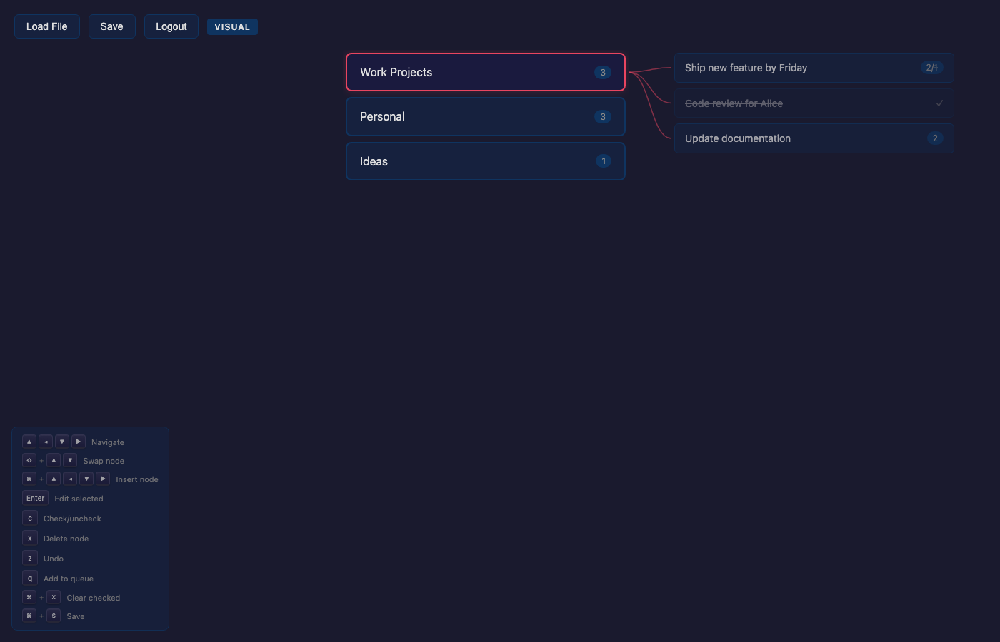
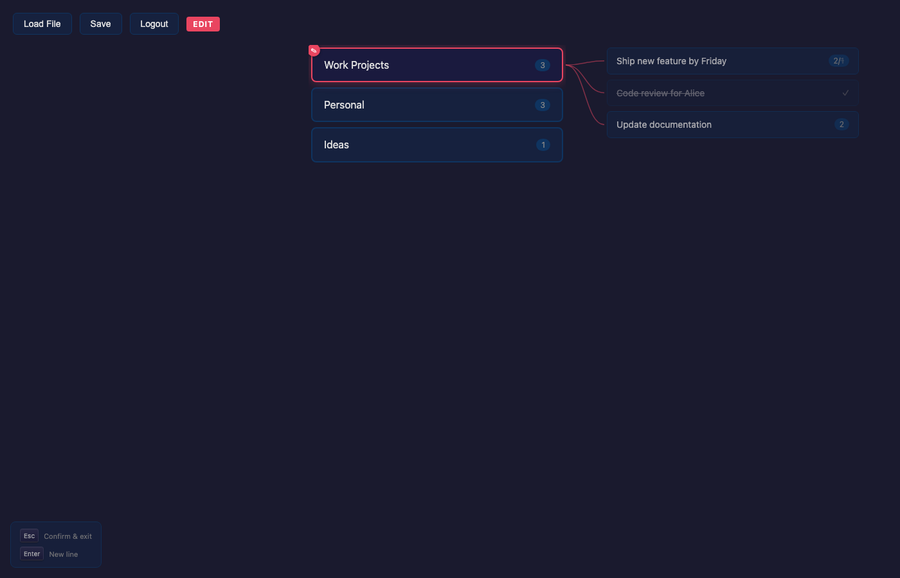
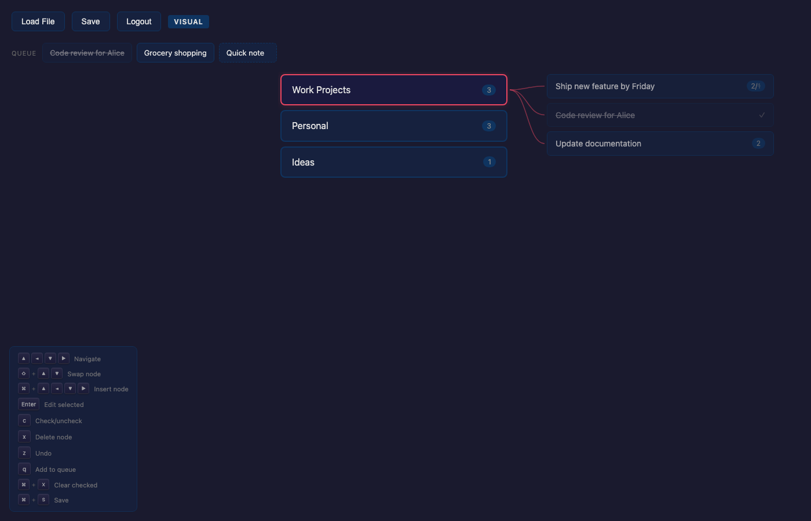

# Treenote

A keyboard-driven tree editor for organizing your thoughts. Navigate, restructure, and check off nodes using only your keyboard. Your notes are stored as a tree that you drill into laterally — no scrolling, no mouse.



## Features

**Tree navigation** — Arrow keys to move between siblings, drill into children, and navigate back to parents. The view slides horizontally as you go deeper, showing parent > current > children columns with SVG connector lines.

**Restructuring** — Move nodes up/down, re-parent them, insert siblings/children/parents, all with keyboard shortcuts. Undo with `z`.

**Checkboxes** — Toggle nodes as done with `c`. Batch-clear all checked nodes with `Cmd+X`. Checked items show with a strikethrough.

**Queue bar** — Pin nodes to a horizontal queue at the top of the screen with `q`. Navigate the queue, reorder items, and check them off with a physics-based eject animation (configurable velocity, gravity, and spin).

**Cloud sync** — Notes auto-save to Supabase with per-user storage and row-level security. Sign in with Google or email magic link.

**Backup & restore** — Automatic periodic backups. Press `b` to browse and restore from any previous snapshot.

**Desktop app** — Runs as an Electron app with native file I/O, or as a web app deployed to Vercel.

## Keybindings

### Graph (visual mode)

| Key | Action |
|-----|--------|
| `Up` / `Down` | Navigate siblings |
| `Right` | Drill into children |
| `Left` | Go to parent |
| `Shift+Up/Down` | Reorder nodes |
| `Cmd+Up/Down` | Insert sibling above/below |
| `Cmd+Right` | Insert child |
| `Cmd+Left` | Insert parent |
| `Alt+Up/Down` | Move into adjacent sibling's children |
| `Alt+Left` | Move node to parent level |
| `Enter` | Edit node text |
| `Escape` | Confirm edit |
| `c` | Toggle checked |
| `x` | Delete node |
| `Cmd+X` | Clear all checked |
| `z` | Undo |
| `Shift+Z` | Redo |
| `q` | Add to queue |
| `b` | Open backup modal |
| `Cmd+S` | Save |

### Queue (when focused)

| Key | Action |
|-----|--------|
| `Left` / `Right` | Navigate queue |
| `Shift+Left/Right` | Reorder queue items |
| `Cmd+Left/Right` | Insert temp item |
| `c` | Check off (ejects with physics) |
| `x` | Remove |
| `q` | Jump to referenced node |
| `Down` | Return to graph |

## Screenshots

| Main tree | Drilled into children |
|---|---|
|  |  |

| Queue bar | Login |
|---|---|
|  |  |

## Tech Stack

- **Frontend**: React 19, Vite 7
- **Desktop**: Electron 40
- **Backend**: Supabase (auth + Postgres with RLS)
- **Storage format**: YAML (auto-detects Markdown for backward compat)
- **Testing**: Playwright with video recording
- **Deployment**: Vercel (web), electron-builder (macOS DMG)

## Setup

```bash
git clone https://github.com/oxue/treenote.git
cd treenote
npm install
```

Create a `.env` file:
```
VITE_SUPABASE_URL=your_supabase_url
VITE_SUPABASE_ANON_KEY=your_supabase_anon_key
```

Run the dev server:
```bash
npm run dev
```

Run as Electron app:
```bash
npm run electron:dev
```

Build for production:
```bash
npm run build              # web
npm run electron:build     # macOS DMG
```

## Autofix Pipeline

This project includes an automated bug-fixing pipeline powered by Claude Code:

1. Create a GitHub issue describing a bug
2. Label it `autofix`
3. The daemon (`scripts/autofix-daemon.sh`) picks it up, spawns Claude in an isolated git worktree
4. Claude reads the issue, implements a fix, writes a Playwright test, and records a video
5. A PR is created automatically with the video proof posted as inline GIFs

Run manually:
```bash
./scripts/fix-issue.sh 5 --watch    # interactive (tmux)
./scripts/fix-issue.sh 5            # headless
./scripts/fix-issue.sh 5 --pr       # create PR from worktree
./scripts/fix-issue.sh 5 --cleanup  # remove worktree after merge
```

Run the daemon:
```bash
./scripts/autofix-daemon.sh
```

Requires: `gh` (GitHub CLI), `ffmpeg`, `tmux`, `claude` (Claude Code CLI).

## License

ISC
